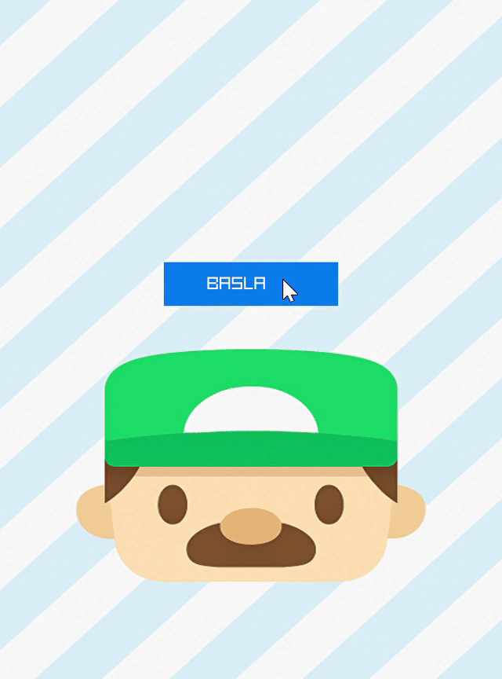
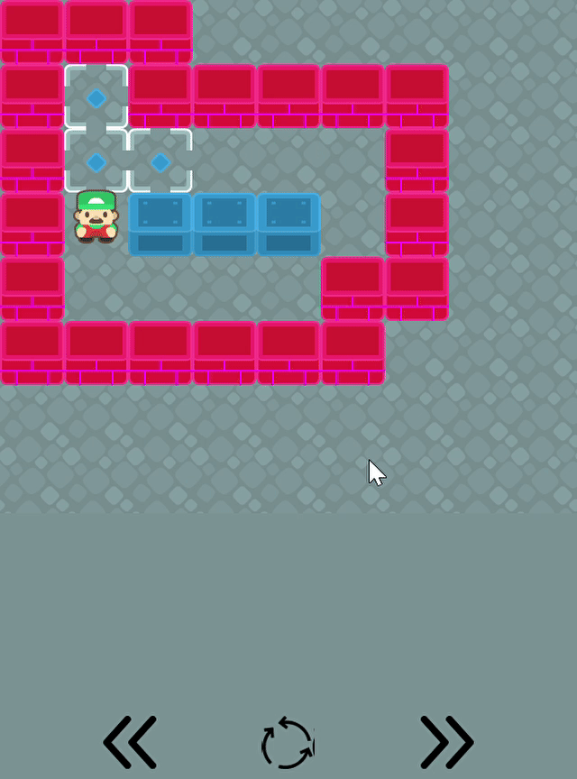
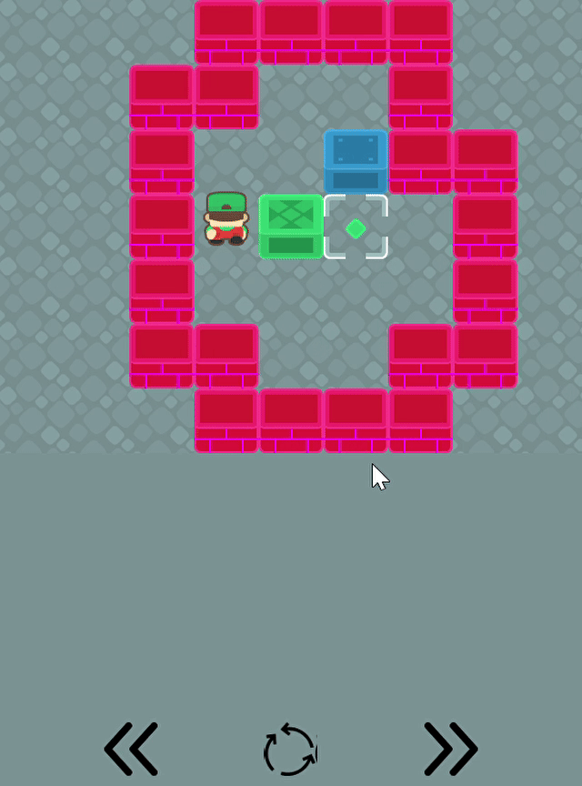
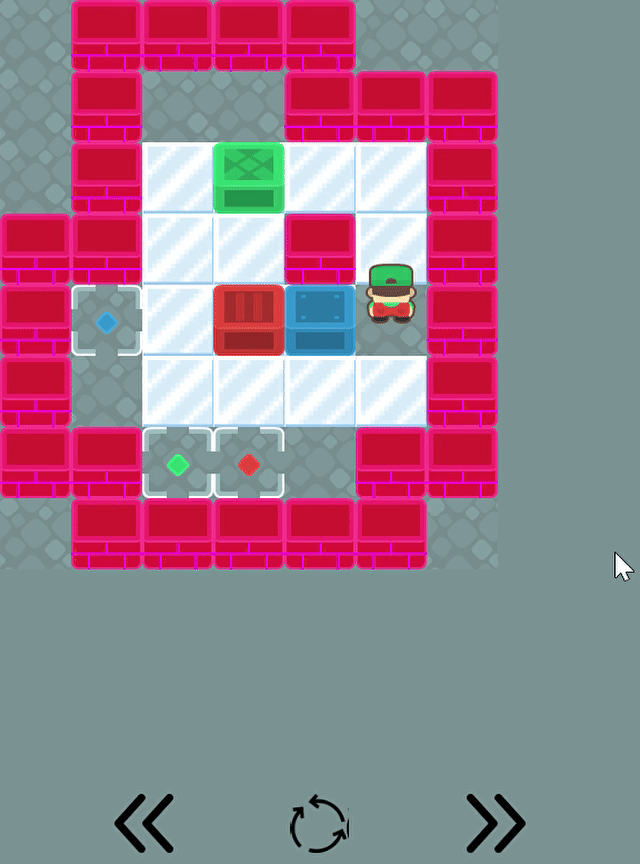
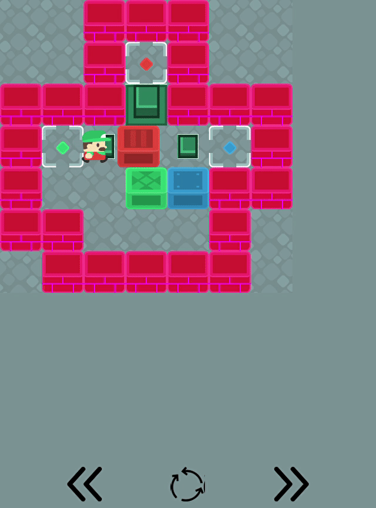
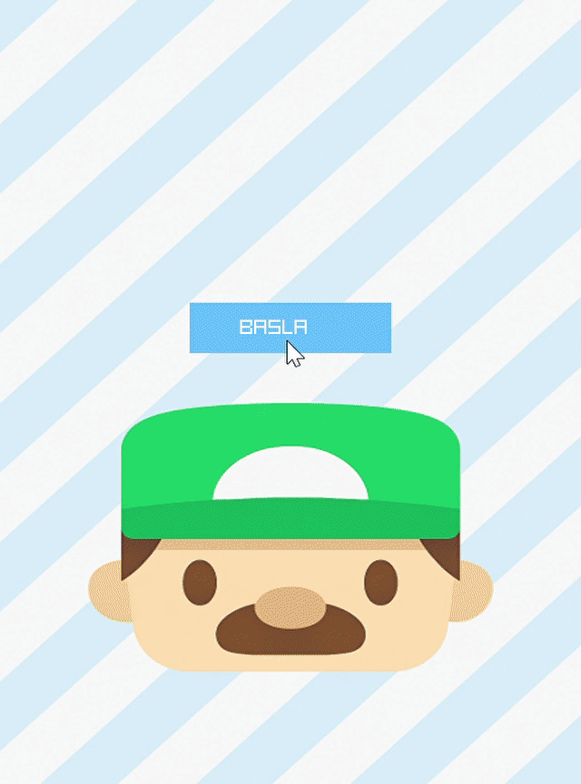
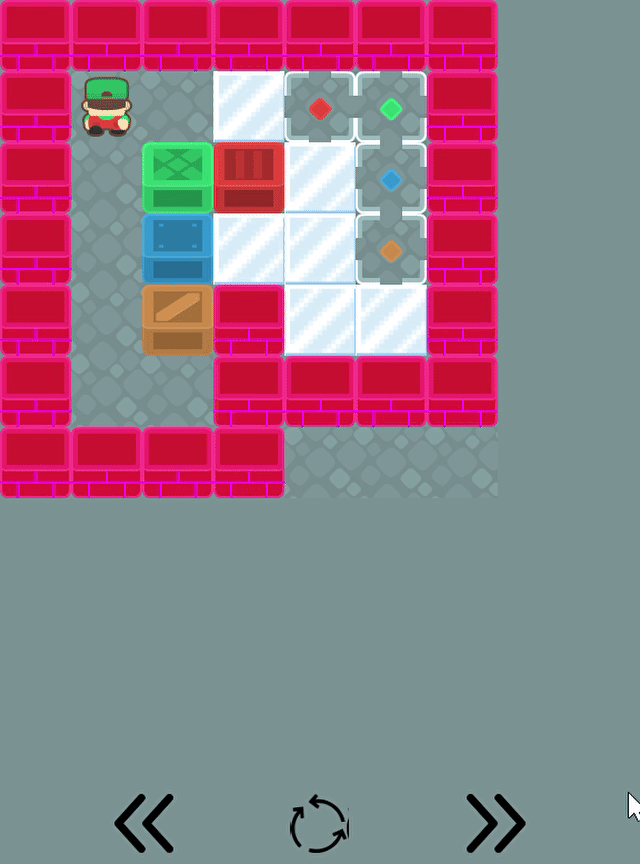

# 🧩 Sokoban Puzzle

## 1. Giriş

Bu proje, **C++ programlama dili** ve **Raylib** kütüphanesi kullanılarak geliştirilen 2D bir puzzle oyunudur. Oyuncu, karakteri kontrol ederek sandıkları belirli hedeflere yerleştirmeye çalışır. Seviyelerdeki **engeller**, **buz mekaniği** ve **kapan sistemleri** ile oyun karmaşıklaşır.

Proje, **nesne yönelimli programlama (OOP)** prensiplerine uygun olarak modüler bir yapıda tasarlanmıştır.

---

### 2. Kontroller
- **Hareket:**  
  -  Karakter `W`, `A`, `S`, `D` tuşları veya `ok tuşları` ile kontrol edilir.
- **Geri Alma (Undo):**  
  - `G` tuşuyla hamleler geri alınır.
- **Seviye Yenileme:**  
  - `T` tuşuyla seviye yenilenir .

---

## 3. Projenin Temel İçeriği

- **Başlangıç Ekranı:** Oyunun başlangıç menüsü ve geçişi

- **Karakter Kontrolü:** WASD ve ok tuşları ile hareket ve sandık itme

- **Sandık-Hedef Eşleştirme:** Renkli sandıkları doğru hedeflere taşıma

- **Buz Mekaniği:** Buz üzerinde kayma 

- **Kapan & Anahtar Sistemi:** Anahtarların basılmasıyla açılan kapılar

- **Seviye Sistemi:** Birden fazla seviye ve ilerleme

- **Geri Alma (Undo):** Karakter ve sandıkları geri alabilme özelliği

## 3. Sistem Tasarımı ve Sınıf Yapısı

Proje, nesne yönelimli prensiplere göre modüler şekilde tasarlanmıştır. Sınıflar üç ana grupta toplanmıştır:

### a. Temel Sınıflar

- **GameObject:** Tüm oyun nesnelerinin türediği soyut sınıf. `Guncelle()` ve `Ciz()` metodlarını içerir.
- **Karakter:** Oyuncunun kontrol ettiği karakter. Hareket, animasyon ve buzda kayma mekanikleri bu sınıfta yönetilir.
- **Sandık:** Renk, konum ve hedef kontrolü özellikleri bulunur. Hedeflere taşınması gereken nesnelerdir.
- **Hedef:** Sandıkların yerleştirilmesi gereken hücrelerdir.
- **Kapan:** Anahtarlar basıldığında açılan kapılardır.

### b. Yönetici Sınıflar

- **ObjeYonetici:** Oyun nesnelerinin (karakter, sandık, hedef) yönetiminden sorumlu.
- **DurumYonetici:** Geri alma özelliği için oyun durumunu kaydeder ve yükler.
- **DokuYonetici:** Görsellerin yüklenmesi ve çizilmesinden sorumludur.
- **KesisimKontrolcu:** Çarpışma ve etkileşim kontrollerinden sorumludur.
- **SeviyeSistemi:** Seviye yükleme, seviyeler arası geçiş ve tamamlanma şartının sorgulamasından sorumludur.

### c. Diğer Bileşenler

- **BaslangicEkrani:** Başlangıç menüsü ve buton yönetimi.
- **GirdiKontrolcu:** Klavye girdilerinin işlenmesi.

---

## 4. Oyun Mekanikleri ve Algoritmalar

### a. Hareket ve Kesişimler

- Karakter ve sandıklar, `KesisimKontrolcu` yardımıyla duvar, sandık ve kapı kesişimlerini kontrol eder.
- Buz üzerinde, nesneler sonraki engelsiz noktaya kadar kayar.

### b. Geri Alma (Undo)

- `DurumYonetici`, her hamle sonrası karakter ve sandık konumlarını kaydeder.
- `GeriAl()` metodu ile önceki durumlara dönülebilir.

### c. Seviye Yükleme

- Sandık, hedef, kapan, karakter konumları ve özellikleri ve harita matrisi her seviyede, seviyeler vektöründen okunur.

---

## 5. Kullanıcı Arayüzü

- **Başlangıç Menüsü:** "Başla" butonu ile oyuncuyu karşılar.
- **Oyun İçi Arayüz:** Seviye numarası ve kontrol butonları (önceki seviye, seviye yenileme, sonraki seviyeye).
- **Seviye Tamamlama Ekranı:** "Sonraki Seviye", "Tekrarla" ve "Önceki Seviye" seçeneklerini içerir.

---

